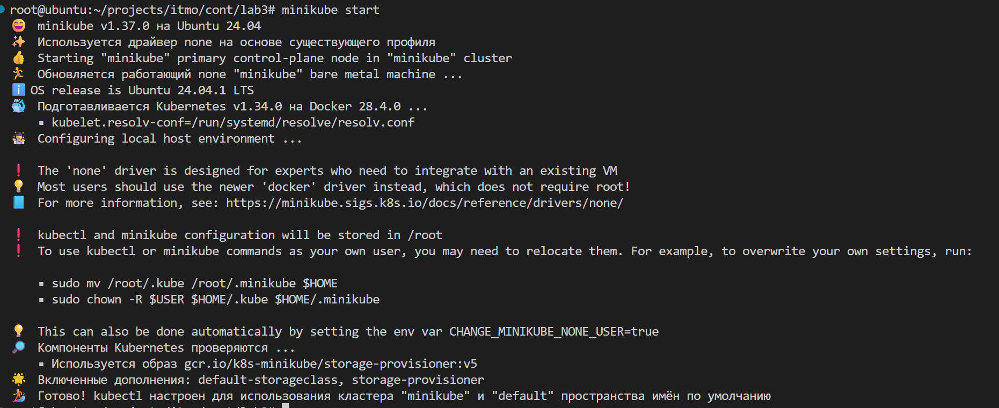
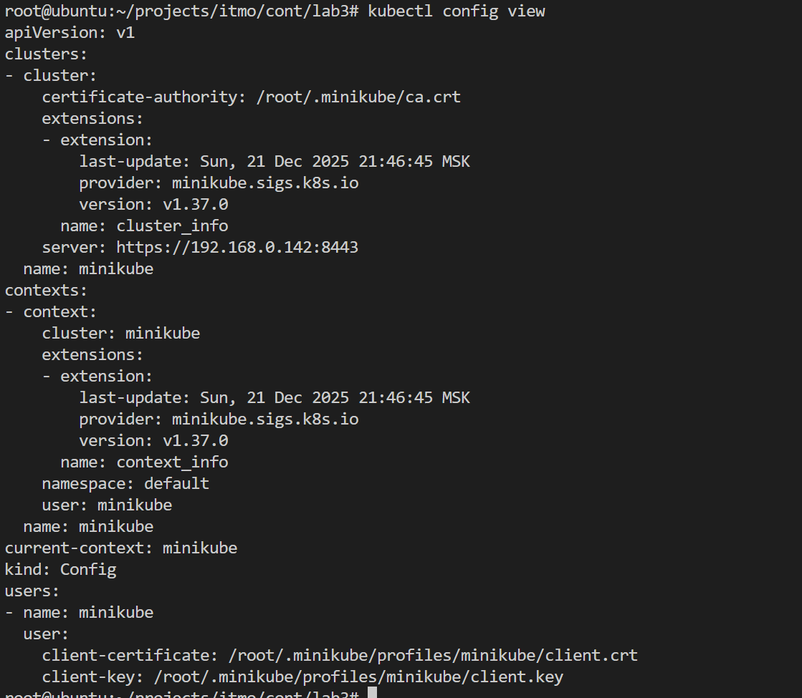
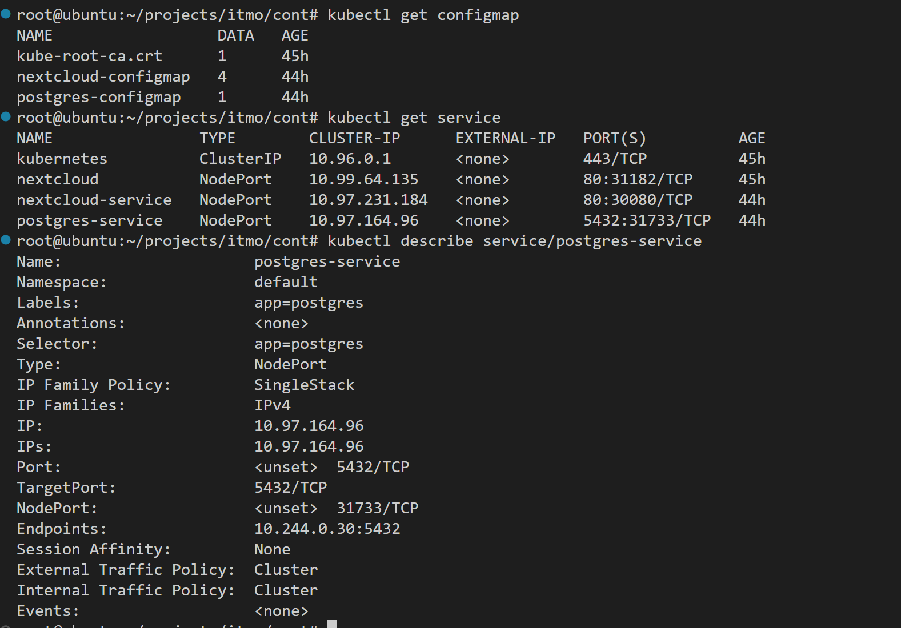
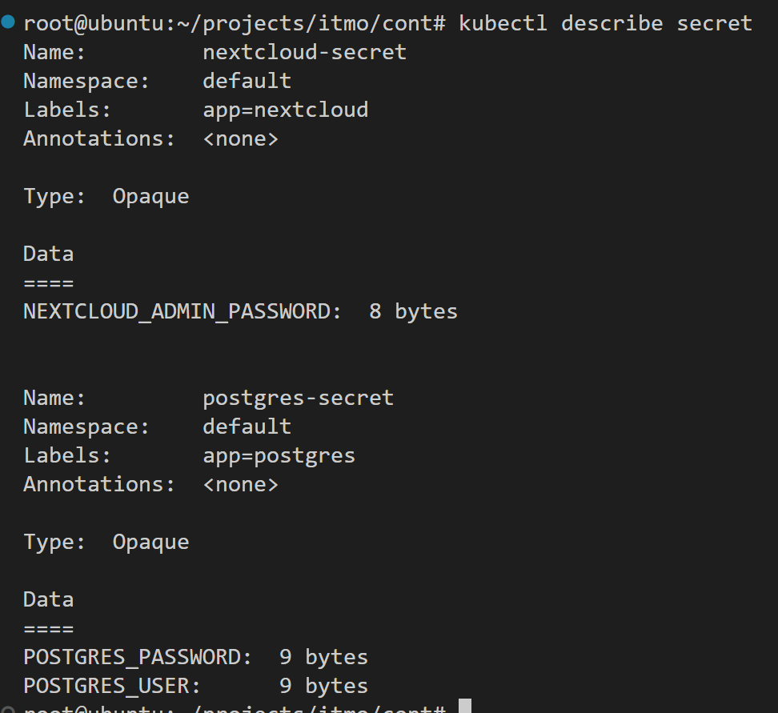
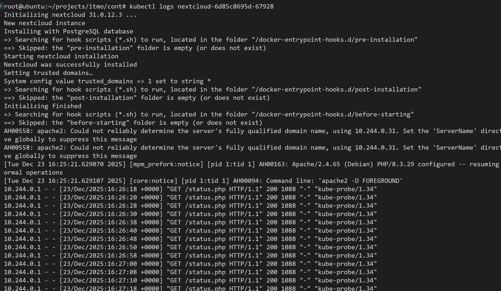
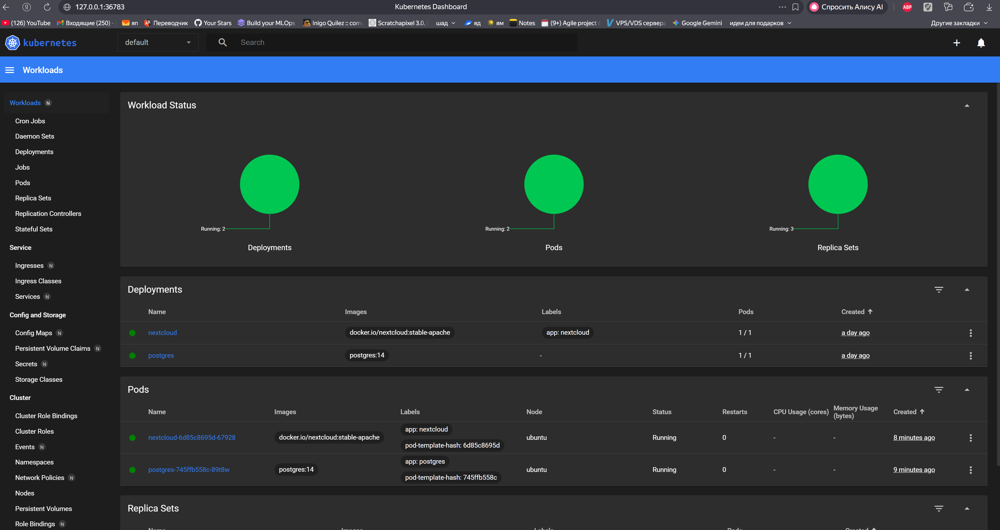

# Lab 3: Kubernetes

## Ход работы

1. Установил и запустил minikube

2. Написал pg и nextcloud манифесты

3. Чувствительные данные хранятся в secret

4. Запустил поды

5. Подключился извне через ингресс

6. Запустил дашборд

8. Добавил Liveness и Readiness проверки. Перенес переменные nextcloud в configmap. Для pg перенес юзера и пароль в секреты (ранее было на скринах)

## Ответы на вопросы

### 1. Вопрос: важен ли порядок выполнения этих манифестов? Почему?
Да, важен. Например, configmap должен быть создан до deployment. Хотя кубер в итоге сможет запустить deployment из за self-healing после создания configmap

### 2. Вопрос: что (и почему) произойдет, если отскейлить количество реплик postgres-deployment в 0, затем обратно в 1, после чего попробовать снова зайти на Nextcloud? 

Postgres запускается без volume, поэтому данные будут потеряны. Будет создана новая база данных. Скорее всего nextcloud упадет, поскольку не найдет ранее созданных таблиц в базе данных